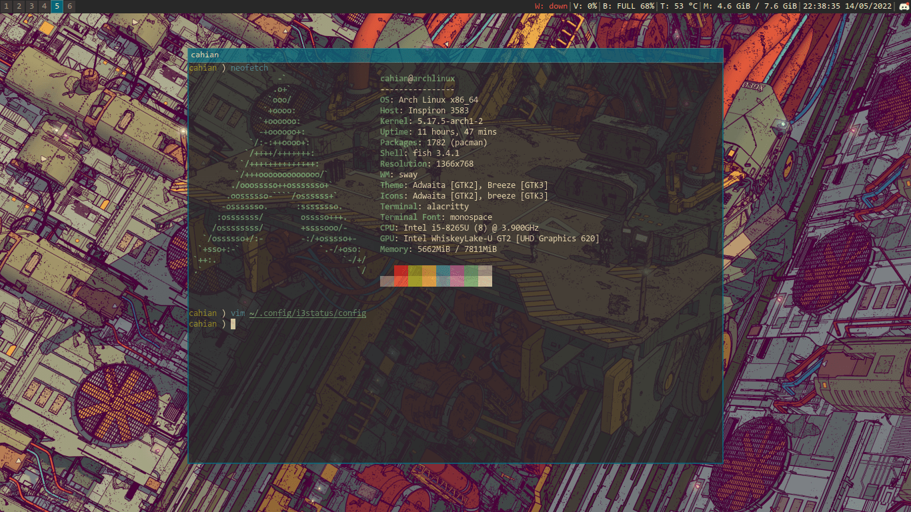

# dotfiles

Sway, Mako, Alacritty, Fish, Neovim and Gruvbox



## Usage

Print help command message:
```
./manager help
```
Copy all directories in `backup.txt` to current folder:
```
./manager sync
```
Copy all directories in `backup.txt` to home folder:
```
./manager restore
```
